`javaScript数据结构与算法`

[toc]

# 第1章简介

## 课程目标

- 掌握数据结构和算法的理论知识
- 补齐求职面试中的算法短板
- 梳理前端和算法结合点，不再纸上谈兵，将算法用于实战

## 课程三部曲

- 理论：数据结构和算法的特点，应用场景等
- 重点关注   数据结构与算法的特点，应用场景，JS实现，空间、时间复杂度

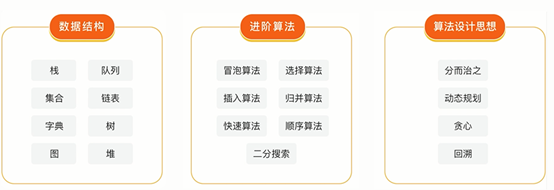

- 刷题：做一些算法题，推荐LeetCode
  -  刷题顺序，按照类型刷题，集中训练
  - 重点关注：通用套路，时间、空间复杂度分析和优化
- 实战：在工作中与数据结构/算法打交道

##  数据结构与算法是什么

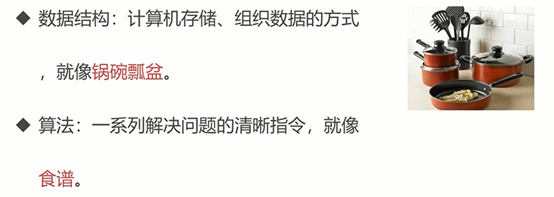

## 数据结构与算法的关系

- 程序= 数据结构+算法
-  数据结构为算法提供服务，算法围绕数据结构操作

##  将要学习的数据结构

- 栈，队列，链表
-  集合、字典
- 树、堆、图
- 链表：遍历链表、删除链表节点
- 树、图：广度/深度优先遍历
- 数组：冒泡/选择/插入/归并/快速排序/顺序/二分搜索


# 第2章 时间/空间复杂度计算

## 时间复杂度

- 一个函数，用O
- 定性

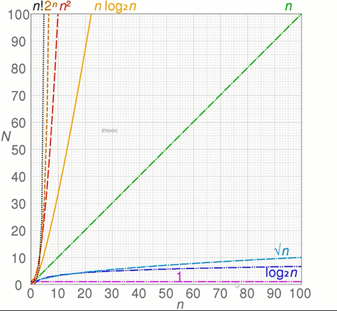

```js
let i = p
i +=1
//O(1)
```

```js
for(let i = 0;i<n;i++){
    console.log(i)//执行n次
}
//O(n)
```

```js
let i = 0
i +=1
for(let j = 0;j<n;j++){
    console.log(j)
}
//O(1)+O(n)=O(n)
```

```js
for(let i = 0 ; i < n ; i++){
    for(let j = 0 ; j < n ; J++){
        console.log(j)
    }
}
//O(n) * O(n) = O(n^2)
```

```js
let i = 1
while(i<n){
    console.log(i)
    i*=2
}

//以2为底  log
//O(logN)
```

##  空间复杂度

- 一个函数，用大O标识，比如O(1)、O(n)、O(n^2)…
- 算法在运行过程中临时占用存储空间大小的量度

```js
let i = 0
i+=1
//O(1)
```

```js
const list = []
for(let i = 0;i<n:i++){
list.push(i)
}
// O(n)
```

```js
const matrix = []
for(let i = 0;i<n;i++){
    matrix.push([])
    for(let j=0;j<n;j++){
        matrix[i].push(j)
    }
}
//矩阵 O(n^2)
```

# 第3章数据结构之“栈”

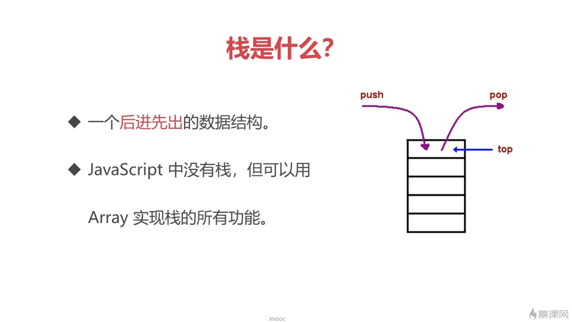

## 栈简介

- 后进先出
- javaScript中没有栈，但是可以用Array实现栈的所有功能

```js
const stack = [];
stack.push(1);//[1]
stack.push(2);//[1,2]
const item1 = stack.pop();//[1] item1=2
const item2 = stack.pop();//[] item2=1
```


## 什么场景下用栈

- 需要`后进先出`的场景
-  比如： 十进制转二进制、判断字符串的括号是否有效、函数调用堆栈

## 场景一：十进制转二进制

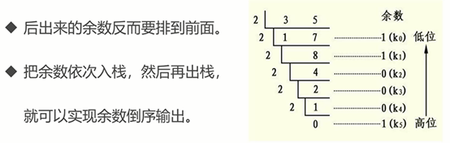

## 场景二：有序的括号

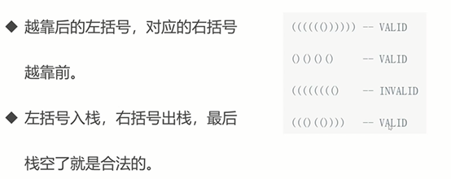

##  函数调用堆栈

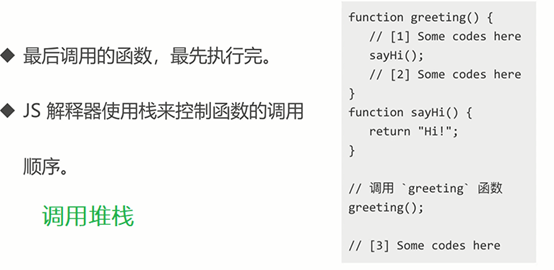

## 题号：20 leetcode 有效的括号

给定一个只包括 '('，')'，'{'，'}'，'['，']' 的字符串 s ，判断字符串是否有效。

有效字符串需满足：

- 左括号必须用相同类型的右括号闭合。
- 左括号必须以正确的顺序闭合。

```js
/**
 * @param {string} s
 * @return {boolean}
 */
var isValid = function(s) {


};

```

### 解题思路—–栈

- 对于没有闭合的左括号而言，越靠后的左括号对应的有括号约靠前
- 满足后进先出，考虑用栈

### 解题步骤

- 建立一个栈
- 扫描字符串
- 遇到`左括号`就`入栈`,
- 遇到栈顶括号类型`匹配的右括号`就`出栈`
- 遇到不匹配的直接判定不合法
- 最后栈空了就合法 否则不合法 length===0

```js
/**
 * @param {string} s
 * @return {boolean}
 */
var isValid = function(s) {
    //字符串不是偶数的 直接不合法
    if(s.length%2===1){return false}
    //建一个栈
    const stack = []
    // 扫描字符串
    for(let i =0 ;i<s.length;i++){
        const c = s[i]
        // 遇见左括号 入栈
        if((c==='(')||(c==="[")||(c==="{")){
            stack.push(c)
        }else{
            // 获取栈顶
            const top = stack[stack.length-1]
            // 判断栈顶是否匹配
            if(
                (top==='('&&c===')')||
                (top==='{'&&c==='}')||
                (top==='['&&c===']')
            ){
                // 匹配就出栈              
                stack.pop()
            }else{
                return false
            }
        }
    }
    // 判断栈空
    return stack.length===0

};
```

## 前端与栈：JS中的函数调用堆栈

```js
const func1 = () => {
    func2();
};
const func2 = () => {
    func3();
};
const func3 = () => {};

func1();

```

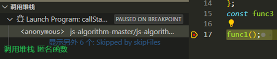

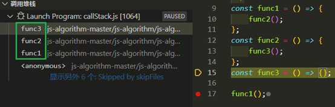

##  栈-章节总结

- 栈是一个后进先出的数据结构
-  JavaScript中没有栈，我们用array实现栈所有功能
- 常用操作：push，pop，stack[stack.length-1]


# 第4章 数据结构之“队列”

## 队列简介 

- `先进先出`的数据结构
- enqueue 入队
- back
-  dequeue 出队
- front
- javaScript没有队列，但是可以用`array`实现队列的所有功能
- array中我们用 `push` 入队 `shift`出队

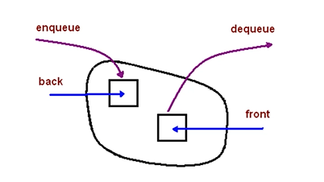

```js
const queue = [];
queue.push(1);//入队[1]
queue.push(2);//入队[1,2]
const item1 = queue.shift();//出队 item1；1   [2]
const item2 = queue.shift();//出队 item2；2   []

```

## 什么场景用队列

- 需要`先进先出
- 比如：食堂排队打饭，js异步中的任务队列，计算最近请求次数

## 场景：食堂打饭

- 先进先出，保证有序

## 场景：JS异步中的任务队列

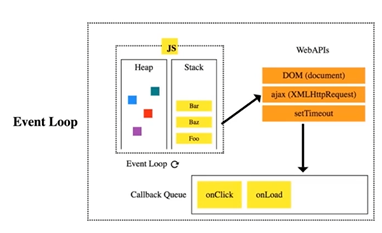


- JS是单线程，无法同时处理异步中的并发问题
- 使用任务队列先后处理`异步任务`

## 场景：计算最近请求次数

- 输入一个数组表示发出请求的时刻

- 输出当前时刻下 3000毫秒内的请求次数

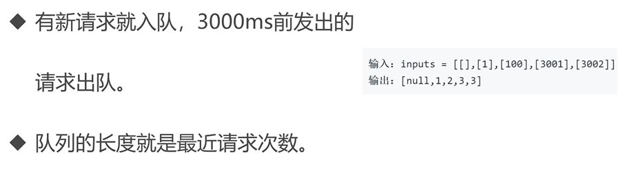

## LeetCode：933. 最近的请求次数

写一个` RecentCounter` 类来计算特定时间范围内最近的请求。

请你实现 `RecentCounter `类：

- RecentCounter() 初始化计数器，请求数为 0 。

- int ping(int t) 在时间 t 添加一个新请求，其中 t 表示以毫秒为单位的某个时间，并返回过去 3000 毫秒内发生的所有请求数（包括新请求）。确切地说，返回在 [t-3000, t] 内发生的请求数。

`保证` 每次对 ping 的调用都使用比之前更大的 t 值。

### 示例：

```js
输入：
["RecentCounter", "ping", "ping", "ping", "ping"]
[[], [1], [100], [3001], [3002]]
输出：
[null, 1, 2, 3, 3]

解释：
RecentCounter recentCounter = new RecentCounter();
recentCounter.ping(1);     // requests = [1]，范围是 [-2999,1]，返回 1
recentCounter.ping(100);   // requests = [1, 100]，范围是 [-2900,100]，返回 2
recentCounter.ping(3001);  // requests = [1, 100, 3001]，范围是 [1,3001]，返回 3
recentCounter.ping(3002);  // requests = [1, 100, 3001, 3002]，范围是 [2,3002]，返回 3
```

```js
var RecentCounter = function() {

};

/** 
 * @param {number} t
 * @return {number}
 */
RecentCounter.prototype.ping = function(t) {

};

/**
 * Your RecentCounter object will be instantiated and called as such:
 * var obj = new RecentCounter()
 * var param_1 = obj.ping(t)
 */
```

### 解题思路

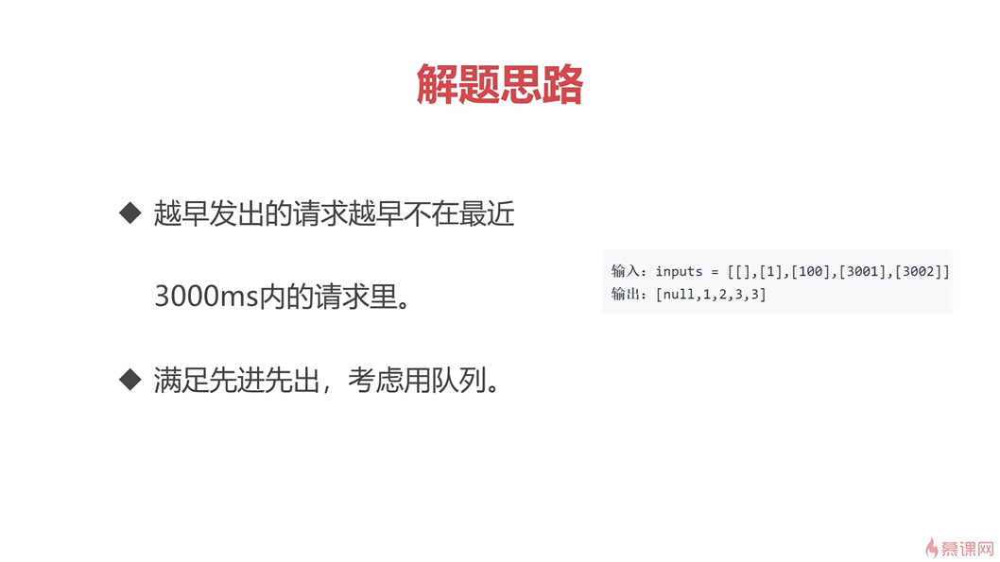

### 解题步骤

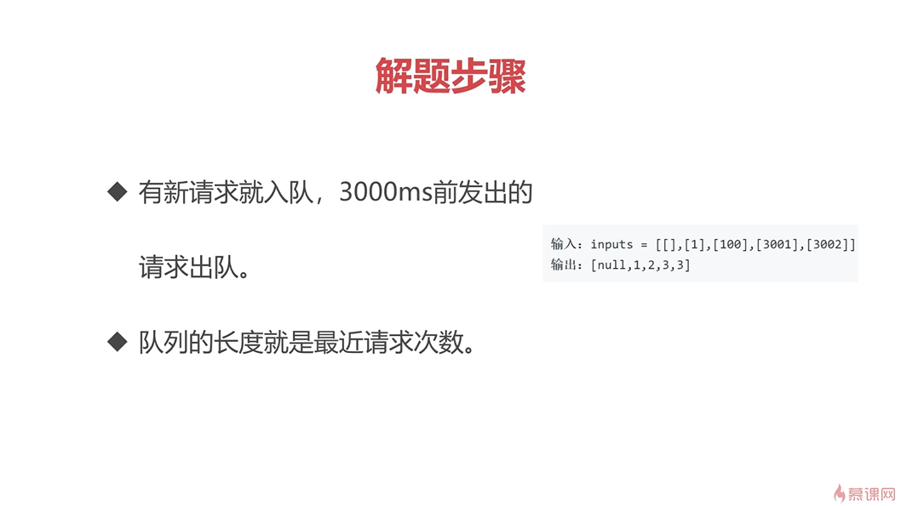

```js
var RecentCounter = function() {//类构造函数
  this.q=[]//将数组挂载在构造函数this中 保证类方法调用的队列为同一个
};

/** 
* @param {number} t
* @return {number}
*/
RecentCounter.prototype.ping = function(t) {//类方法 ping
  this.q.push(t)//t 先进站
    //判断对头在不在范围内 不在就踢出去
  while(this.q[0]<t-3000){
      this.q.shift();//出队
  }
  return this.q.length
};

/**
* Your RecentCounter object will be instantiated and called as such:
* var obj = new RecentCounter()
* var param_1 = obj.ping(t)
*/

```

## 前端与队列：JS 异步中的任务队列 

```js
settimeout(()=>{
    console.log(1)
},0)
console.log(2)

// 2 1
```

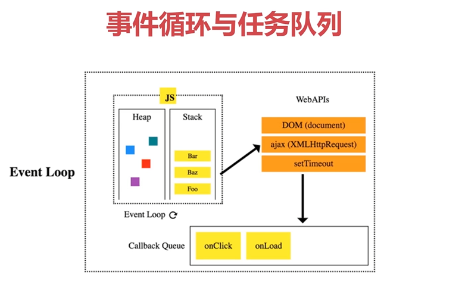

## 队列-章节总结


